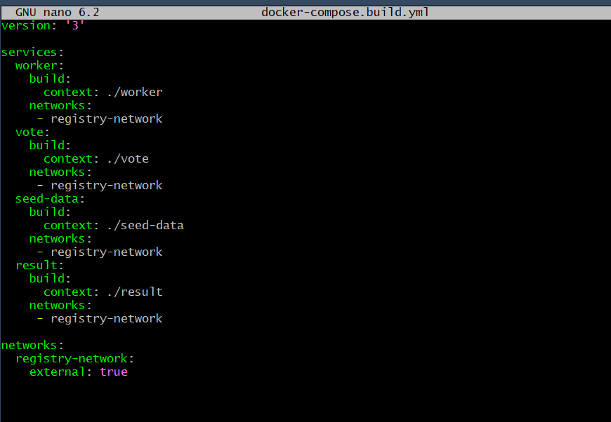
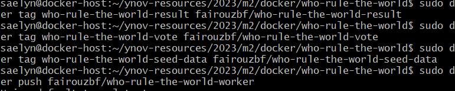
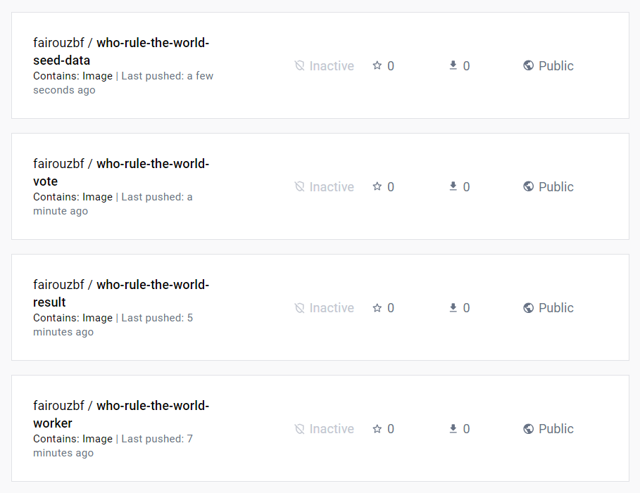
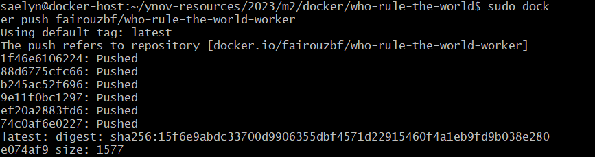
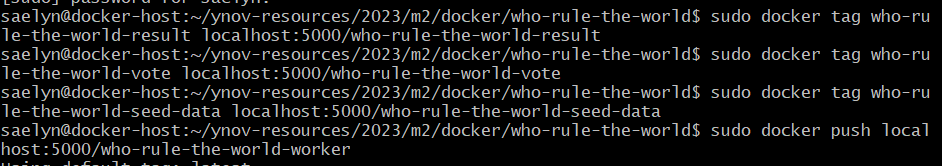
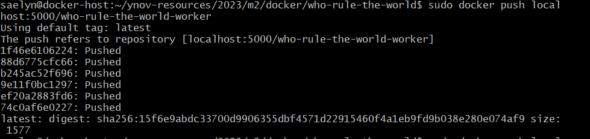
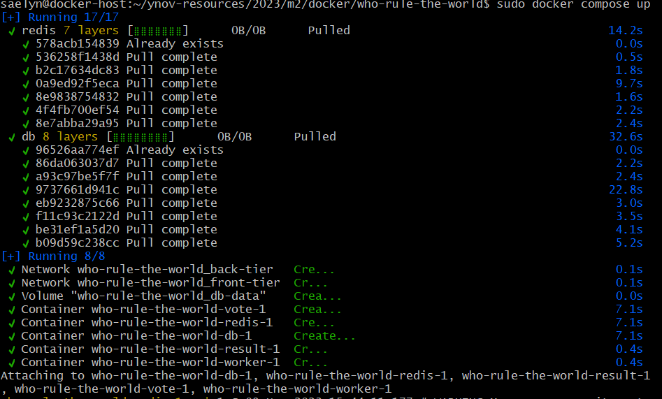
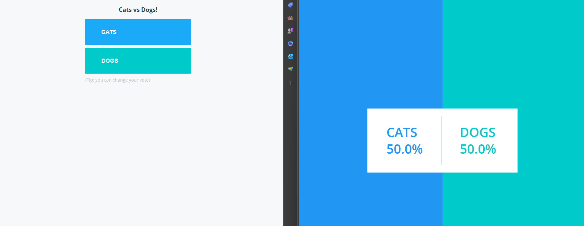

# SUBMISSION : Docker Evaluation

BEN FRAJ Fairouz / BOURAS Nadia / GEORGES Elodie


## Sommaire

 - [Introduction](#introduction)
 - [VM Connection](#vm-connection)
 - [Creating images](#creating-images)
 - [Containers](#containers)
 - [Results](#results)
 - [Conclusion](#conclusion)

## Introduction

We are going to set up a voting application with real-time results display. This application includes several microservices that will be hosted on our virtual machine and accessible from our local machine. Each service will use a Docker container. All these containers will run on our virtual machine.

## VM Connection

We will connect to the virtual machine using the SSH function as we did in the previous assessment.

## Creating images

1. Fork the repository

2. Create Dockerfiles for each containers, worker, vote, seed-data and result.

3. At the root create the docker-compose.build.yml file: 
```
version: '3' 
services:
	worker:
		build:
			context: ./worker 
		networks: 
		 - registry-network 
	vote:
		build:
			context: ./vote 
		networks: 
		 - registry-network 
	seed-data: 
		build:
			context: ./seed-data 
		networks: 
		 - registry-network 
	result:
		build:
			context: ./result 
		networks:
		 - registry-network 

networks:
	registry-network: 
		external: true
```


4. Tag and publish on my public registry:
```
sudo docker tag who-rule-the-world-worker fairouzbf/who-rule-the-world-worker
sudo docker tag who-rule-the-world-result fairouzbf/who-rule-the-world-result
sudo docker tag who-rule-the-world-vote fairouzbf/who-rule-the-world-vote
sudo docker tag who-rule-the-world-seed-data fairouzbf/who-rule-the-world-seed-data

sudo docker push fairouzbf/who-rule-the-world-worker
sudo docker push fairouzbf/who-rule-the-world-worker
sudo docker push fairouzbf/who-rule-the-world-worker
sudo docker push fairouzbf/who-rule-the-world-worker
```





5. Tag and publish on my private registry:
```
sudo docker tag who-rule-the-world-worker localhost:5000/who-rule-the-world-worker
sudo docker tag who-rule-the-world-result localhost:5000/who-rule-the-world-result
sudo docker tag who-rule-the-world-vote localhost:5000/who-rule-the-world-vote
sudo docker tag who-rule-the-world-seed-data localhost:5000/who-rule-the-world-seed-data

sudo docker push localhost:5000/who-rule-the-world-worker
sudo docker push localhost:5000/who-rule-the-world-result
sudo docker push localhost:5000/who-rule-the-world-vote
sudo docker push localhost:5000/who-rule-the-world-seed-data
```




## Containers

### Write the compose.yml file:
```
services:
  worker:
    image: localhost:5000/who-rule-the-world-worker
    depends_on:
      redis:
        condition: service_healthy
      db:
        condition: service_healthy
    networks:
      - back-tier

  vote:
    image: localhost:5000/who-rule-the-world-vote
    ports:
      - "5002:80"
    networks:
      - front-tier
      - back-tier
    healthcheck:
      test: ["CMD", "curl", "-f", "http://localhost"]
      interval: 15s
      timeout: 5s
      retries: 3
      start_period: 10s
    volumes:
      - ./vote:/usr/local/app

  seed-data:
    image: localhost:5000/who-rule-the-world-seed-data
    profiles: ["seed"]
    depends_on:
      vote:
        condition: service_healthy
    restart: "no"
    networks:
      - front-tier

  result:
    image: localhost:5000/who-rule-the-world-result
    volumes:
      - ./result:/usr/local/app
    ports:
      - "5001:80"
      - "127.0.0.1:9229:9229"
    networks:
      - back-tier
    entrypoint: nodemon --inspect=0.0.0.0 server.js
    depends_on:
      db:
        condition: service_healthy
  db:
    image: postgres:15-alpine
    networks:
      - back-tier
    volumes:
      - "db-data:/var/lib/postgresql/data"
      - "./healthchecks:/healthchecks"
    healthcheck:
      test: /healthchecks/postgres.sh
      interval: "5s"
    environment:
      POSTGRES_PASSWORD: "postgres"
      POSTGRES_USER: "postgres"
      POSTGRES_DB: "postgres"
    ports:
      - 5432:5432

  redis:
    image: redis
    volumes:
      - "./healthchecks:/healthchecks"
    networks:
      - back-tier
    healthcheck:
      test: /healthchecks/redis.sh
      interval: "5s"

networks:
  front-tier:
  back-tier:

volumes:
  db-data:
```
### Use docker compose command


## Results
### Port Forwarding
We set up the port forwarding to access ports 5000 & 5001 from our local machine and configure these settings on VirtualBox in our VM's parameters.

### Screenshot of the results


## Conclusion

We set up two applications with services that are interconnected. We exposed them on our local machine, and we can access these applications via the URL: localhost:5000 or localhost:5001 for the results.

We used Docker Compose to quickly create multiple containers simultaneously. Moreover, these microservices run on the virtual machine and are accessible from the local machine.
